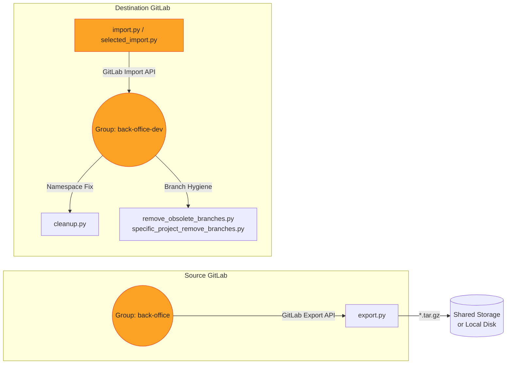

# GitLab Migration & Branch‑Housekeeping Toolkit 🚀

A **battle‑tested Python toolkit** that automates:

* **Full‑project exports** from a source GitLab instance
* **Clean, namespace‑safe imports** into a destination GitLab instance
* **Post‑import cleanup** (fixing wrong namespaces, trimming obsolete branches, enforcing branch standards)

Built with the official [`python‑gitlab`](https://python-gitlab.readthedocs.io/) SDK, these scripts have helped teams migrate **50 + micro‑repos** in minutes—while keeping branch hygiene spotless.

---

## 📑 Table of Contents

1. [High‑Level Architecture](#architecture)
2. [Prerequisites](#prerequisites)
3. [Quick Start](#quick-start)
4. [Script Walk‑Through](#script-walk-through)
   5.1 [export.py](#exportpy) 5.2 [import.py](#importpy) 5.3 [selected\_import.py](#selected_importpy)
   5.4 [cleanup.py](#cleanuppy) 5.5 [remove\_obsolete\_branches.py](#remove_obsolete-branchespy)
   5.6 [specific\_project\_remove\_branches.py](#specific_project_remove_branchespy)
5. [End‑to‑End Migration Guide](#step-by-step-migration)
6. [Troubleshooting](#troubleshooting)
7. [Extending the Toolkit](#extending)
8. [License](#license)

---


## 🗺️ Architecture<a name="architecture"></a>



* **export.py** triggers asynchronous exports and downloads resulting archives
* **import.py / selected\_import.py** stream archives into the correct destination group
* **cleanup.py** deletes projects accidentally imported under default user namespaces
* **Branch scripts** enforce a *single‑source‑of‑truth* `demo` branch and spawn `demo2`

---

## ⚙️ Prerequisites<a name="prerequisites"></a>

| Requirement                     | Notes                                      |
| ------------------------------- | ------------------------------------------ |
| **Python ≥ 3.8**                | Tested on 3.8–3.12                         |
| **pip install `python‑gitlab`** | `pip install python-gitlab`                |
| **Personal Access Tokens**      | **`api`** scope on *both* GitLab instances |
| **Export/Import permissions**   | Admin or Maintainer on all projects        |
| **Shell access**                | For running scripts & storing archives     |

---

## ⚡ Quick Start<a name="quick-start"></a>

```bash
# 1 · Clone this repo
git clone https://github.com/your‑org/gitlab-migration-toolkit.git
cd gitlab-migration-toolkit

# 2 · Install dependencies
python3 -m venv .venv && source .venv/bin/activate
pip install -r requirements.txt          # just python-gitlab

# 3 · Configure environment variables (safer than hard‑coding)
export SRC_GITLAB=https://gitlab.example.com
export SRC_TOKEN=glpat‑xxxxxxxxxxxxxxxx
export DST_GITLAB=https://gitlab-dev.example.com
export DST_TOKEN=glpat‑yyyyyyyyyyyyyyyy

# 4 · Export all projects under source group
python export.py

# 5 · Import everything into destination group
python import.py                         # or python selected_import.py

# 6 · Post‑import fixes
python cleanup.py
python remove_obsolete_branches.py
```

---

## 🔍 Script Walk‑Through<a name="script-walk-through"></a>

### 5.1 export.py<a name="exportpy"></a>

| Step                                                           | Logic |
| -------------------------------------------------------------- | ----- |
| **Authenticate** to `SOURCE_GITLAB_URL`                        |       |
| Fetch **all projects** in `back-office` (including sub‑groups) |       |
| Call **Export API** (`POST /projects/:id/export`)              |       |
| Poll until `export_status == finished`                         |       |
| **Download tarball** in 1 MiB chunks → `project.path.tar.gz`   |       |

### 5.2 import.py<a name="importpy"></a>

| Step                                                                                                                                              | Logic |
| ------------------------------------------------------------------------------------------------------------------------------------------------- | ----- |
| Auth to **destination** GitLab                                                                                                                    |       |
| Verify/auto‑create **target group**                                                                                                               |       |
| Stream each `*.tar.gz` into **Import API** (`/projects/import`) with <br/>`namespace` + `namespace_id` → eliminates “root/Administrator” mistakes |       |
| Poll `import_status` until *finished* / *failed*                                                                                                  |       |
| Warn if imported into the **wrong namespace**                                                                                                     |       |

### 5.3 selected\_import.py<a name="selected_importpy"></a>

Same as **import.py** but lets you pass a **pick‑list** (`SELECTED_PROJECTS`)—handy for phased migrations or retries.

### 5.4 cleanup.py<a name="cleanuppy"></a>

Scans for projects that landed in `root` or `Administrator`, then **deletes** them so you can re‑import cleanly.

### 5.5 remove\_obsolete\_branches.py<a name="remove_obsolete-branchespy"></a>

For **every project** in a group:

1. Ensure a `demo` branch exists
2. **Delete** all other branches (respecting protection rules)
3. **Create** `demo2` from `demo`
4. Set `demo` as the **default** branch

### 5.6 specific\_project\_remove\_branches.py<a name="specific_project_remove_branchespy"></a>

Same logic as above, but targets **one repo** (`TARGET_PROJECT_NAME`)—great for gradual roll‑outs.

---

## 🛠️ Step‑by‑Step Migration Guide<a name="step-by-step-migration"></a>

| # | Action                   | Command / Notes                                                                   |        |
| - | ------------------------ | --------------------------------------------------------------------------------- | ------ |
| 1 | **Back up**(optional)    | Snapshot runners, variables, CI templates                                         |        |
| 2 | **Export** projects      | `python export.py` → `*.tar.gz` in working dir                                    |        |
| 3 | **Verify** archives      | \`tar -tzf project.tar.gz                                                         | head\` |
| 4 | **Import** into dest     | `python import.py` (bulk) **or** `python selected_import.py` (subset)             |        |
| 5 | **Fix wrong namespaces** | `python cleanup.py`                                                               |        |
| 6 | **Branch hygiene**       | `python remove_obsolete_branches.py` **or** `specific_project_remove_branches.py` |        |
| 7 | **Validate CI/CD**       | Trigger pipelines, check secrets, runners                                         |        |
| 8 | **Audit**                | Compare commit counts, tags, releases                                             |        |

---

## 🆘 Troubleshooting<a name="troubleshooting"></a>

| Symptom                              | Cause & Fix                                                               |
| ------------------------------------ | ------------------------------------------------------------------------- |
| `GitlabGetError: 404` fetching group | Token lacks **`read_api`** scope *or* wrong group path                    |
| Import stuck at `scheduled`          | Destination runner is **paused**—check Admin > Rake tasks                 |
| `/tmp/… no space left`               | Move exports to bigger disk or set `TMPDIR`                               |
| Protected branch deletion fails      | Script auto‑unprotects; if it still fails, you lack **Maintainer** rights |

---

## 🔧 Extending<a name="extending"></a>

* **Overwrite logic**: set `overwrite=True` in `import_params` (already included).
* **Tag/Release migration**: call the Releases API post‑import.
* **CI variable migration**: iterate over `/projects/:id/variables`.

---

## 📜 License<a name="license"></a>

Released under the **MIT License** — free to use, modify, and share. Pull requests welcome!
