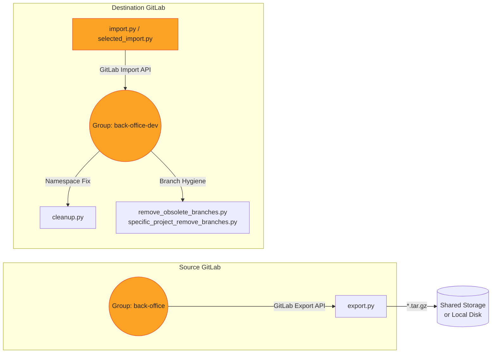

# GitLab Migration & Branch‑Housekeeping Toolkit 🚀

A **battle‑tested Python toolkit** that automates:

* **Full‑project exports** from a source GitLab instance
* **Clean, namespace‑safe imports** into a destination GitLab instance
* **Post‑import cleanup** (fixing wrong namespaces, trimming obsolete branches, enforcing branch standards)

Built with the official [`python‑gitlab`](https://python-gitlab.readthedocs.io/) SDK, these scripts have helped teams migrate **50 + micro‑repos** in minutes while keeping branch hygiene spotless.

---

## Table of Contents

1. [High-Level Architecture](#high-level-architecture)
2. [Prerequisites](#prerequisites)
3. [Quick Start](#quick-start)
4. [Script Walk-Through](#script-walk-through)

   1. [export.py](#exportpy)
   2. [import.py](#importpy)
   3. [selected\_import.py](#selected-importpy)
   4. [cleanup.py](#cleanuppy)
   5. [remove\_obsolete\_branches.py](#remove-obsolete-branchespy)
   6. [specific\_project\_remove\_branches.py](#specific-project-remove-branchespy)
5. [End-to-End Migration Guide](#end-to-end-migration-guide)
6. [Troubleshooting](#troubleshooting)
7. [Extending the Toolkit](#extending-the-toolkit)
8. [License](#license)

---

## High-Level Architecture



📂 **Directory layout**

```
.
├── scripts/
│   ├── export.py
│   ├── import.py
│   ├── selected_import.py
│   ├── cleanup.py
│   ├── remove_obsolete_branches.py
│   └── specific_project_remove_branches.py
└── README.md (this file)
```

* **export.py** triggers asynchronous exports and downloads resulting archives
* **import.py / selected\_import.py** stream archives into the correct destination group
* **cleanup.py** deletes projects accidentally imported under default user namespaces
* **Branch scripts** enforce a *single‑source‑of‑truth* `demo` branch and spawn `demo2`

---

## Prerequisites

| Requirement                     | Notes                                  |
| ------------------------------- | -------------------------------------- |
| **Python ≥ 3.8**                | Tested on 3.8 → 3.12                   |
| **pip install `python‑gitlab`** | `pip install python-gitlab`            |
| **Personal Access Tokens**      | `api` scope on *both* GitLab instances |
| **Export/Import permissions**   | Admin or Maintainer on all projects    |
| **Shell access**                | For running scripts & storing archives |

> Store tokens with a secrets manager or environment variables. The scripts will automatically fall back to environment variables if present (see comments inside each script).

---

## Quick Start

```bash
# 1 · Clone this repo
$ git clone https://github.com/SubhanshuMG/gitlab-import-export.git
$ cd gitlab-import-export

# 2 · Create & activate virtual‑env
$ python3 -m venv .venv && source .venv/bin/activate
$ pip install -r requirements.txt   # currently only python-gitlab

# 3 · Export environment variables (safer than hard‑coding)
$ export SRC_GITLAB=https://gitlab.example.com
$ export SRC_TOKEN=glpat‑xxxxxxxxxxxxxxxx
$ export DST_GITLAB=https://gitlab-dev.example.com
$ export DST_TOKEN=glpat‑yyyyyyyyyyyyyyyy

# 4 · Export all projects under source group
$ python scripts/export.py

# 5 · Import everything into destination group
$ python scripts/import.py          # or python scripts/selected_import.py

# 6 · Post‑import fixes
$ python scripts/cleanup.py
$ python scripts/remove_obsolete_branches.py
```

---

## Script Walk-Through

### 4.1 export.py<a name="exportpy"></a>

| Step              | Purpose                                                        |
| ----------------- | -------------------------------------------------------------- |
| Authenticate      | Login to `$SRC_GITLAB` with PAT                                |
| Discover projects |  Lists every project in `back-office` incl. sub‑groups         |
| Trigger export    | `POST /projects/:id/export`                                    |
| Poll status       | Waits until `export_status == 'finished'`                      |
| Download          | Streams tarball in 1 MiB chunks → `./exports/{project}.tar.gz` |

### 4.2 import.py<a name="importpy"></a>

| Step                | Purpose                                                                                            |
| ------------------- | -------------------------------------------------------------------------------------------------- |
| Auth to destination | `$DST_GITLAB` PAT                                                                                  |
| Verify target group | Auto‑create if missing (code ready for enhancement)                                                |
| Stream import       | `POST /projects/import` supplying `namespace` & `namespace_id` to dodge “root/Administrator” traps |
| Monitor             | Polls `import_status` every 5 s                                                                    |
| Validate namespace  | Warns if import landed outside intended group                                                      |

### 4.3 selected\_import.py<a name="selected-importpy"></a>

Same as **import.py** but only for names in `SELECTED_PROJECTS`—ideal for re‑tries or phased rollouts.

### 4.4 cleanup.py<a name="cleanuppy"></a>

Deletes projects that mistakenly got imported under `root` or any namespace in `WRONG_NAMESPACE_PATHS`.

### 4.5 remove\_obsolete\_branches.py<a name="remove-obsolete-branchespy"></a>

For **every** repo in a group:

1. Verify `demo` branch exists
2. Delete **all** other branches (auto‑unprotect if needed)
3. Create `demo2` from `demo`
4. Set `demo` as default branch

### 4.6 specific\_project\_remove\_branches.py<a name="specific-project-remove-branchespy"></a>

Same algorithm as above, but scoped to a **single** repo defined by `TARGET_PROJECT_NAME`.

---

## End-to-End Migration Guide

| # | Action                           | Command / Notes                                                                     |        |
| - | -------------------------------- | ----------------------------------------------------------------------------------- | ------ |
| 1 | **Snapshot / Backup** (optional) | Backup runners, project variables, pipeline schedules                               |        |
| 2 | **Export**                       | `python scripts/export.py` → `exports/*.tar.gz`                                     |        |
| 3 | **Inspect** archives             | \`tar -tzf exports/<name>.tar.gz                                                    | head\` |
| 4 | **Import**                       | `python scripts/import.py` (bulk) *or* `python scripts/selected_import.py` (subset) |        |
| 5 | **Namespace sanity**             | `python scripts/cleanup.py`                                                         |        |
| 6 | **Branch hygiene**               | `python scripts/remove_obsolete_branches.py` *or* targeted script                   |        |
| 7 | **CI/CD validation**             | Trigger pipelines, verify secrets, runners                                          |        |
| 8 | **Audit**                        | Compare commit counts, releases, tags                                               |        |

---

## Troubleshooting

| Symptom                         | Cause & Fix                                                        |
| ------------------------------- | ------------------------------------------------------------------ |
| `GitlabGetError: 404` on group  | PAT lacks `read_api` scope *or* wrong `TARGET_GROUP_PATH`          |
| Import stuck at **scheduled**   | Destination Sidekiq queue overloaded or instance runner **paused** |
| `/tmp/… no space left`          | Move exports to larger disk or set `TMPDIR` env var                |
| Protected branch deletion fails | Script unprotects automatically—ensure you’re **Maintainer**       |

---

## Extending the Toolkit

* **Overwrite imports**: set `overwrite=True` in `import_params` (already done).
* **Parallel exports**: wrap export calls with `concurrent.futures.ThreadPoolExecutor`.
* **CI Variables & Releases**: iterate `/projects/:id/variables` and `/releases` after import.
* **SaaS → Self-managed**: add mapping for group paths that differ between instances.

---

## License

MIT © 2025
